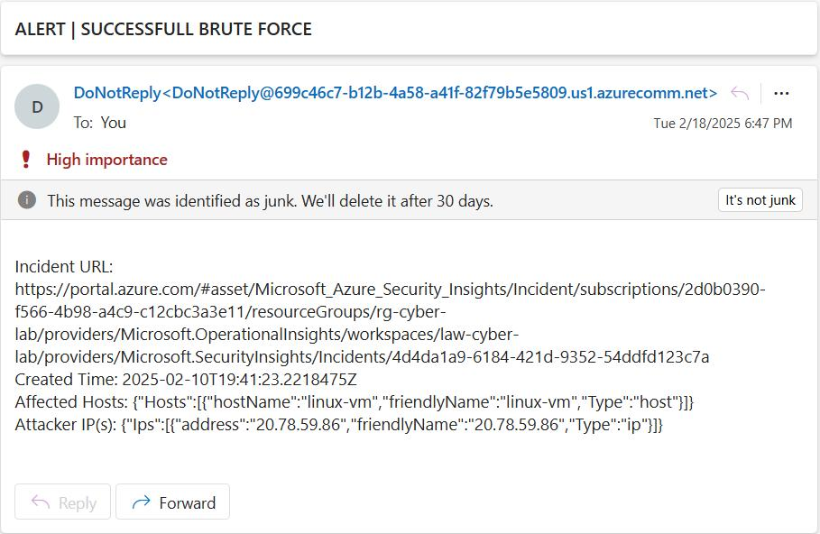

# **Simulating and Working a Linux Brute Force Incident in Azure SIEM (NIST 800-61)**
## Introduction
This write-up demonstrates simulating and detecting brute force attacks on a Linux VM in Azure, using the [Azure Honey Net SIEM Project](). An attack VM and a PowerShell script target an intentionally exposed environment, with logs collected via Syslog and ingested into Microsoft Sentinel.

A Sentinel Analytics Rule detects the attack and generates an alert, while a Playbook is used to automate response actions in line with **NIST 800-61**. The VM’s network security group (NSG) is initially configured as open, making the VM accessible from the public internet for attack simulation


## Simulating the Brute Force Success and Triggering the Analytics Rule
The following PowerShell script simulates a successful brute force attack against the Linux VM, triggering the Sentinel analytics rule:
```powershell
Import-Module Posh-SSH

$vmIp = "PUBLIC_IP"  # Target VM's public IP
$wrongPassword = "__BAD_PASSWORD__"  # Fake password for failures
$correctPassword = "PASSWORD"  # Real SSH password
$realusername = "USERNAME"  # Real username
$users = @("admin", "test", "root", "fakeuser") # Fake usernames for failures
$attempts = 30  # Number of failed attempts before success

Write-Host "Starting brute-force simulation against $vmIp..."

# Simulate failed login attempts
for ($i = 1; $i -le $attempts; $i++) {
    Write-Host "Attempt ${i}: Trying incorrect login..."
    try {
        Start-Sleep -Seconds 2  
        $username = $users[(Get-Random -Maximum $users.Length)]
        $secpasswd = ConvertTo-SecureString $wrongPassword -AsPlainText -Force
        $Credentials = New-Object System.Management.Automation.PSCredential($username, $secpasswd)
        New-SSHSession -ComputerName $vmIp -Credential $Credentials -ErrorAction Stop
    } catch {
        Write-Host "Login failed (expected)."
    }
}

Write-Host "Attempting successful login..."

# Successfully login
try {
    $secpasswd = ConvertTo-SecureString $correctPassword -AsPlainText -Force
    $Credentials = New-Object System.Management.Automation.PSCredential($realusername, $secpasswd)
    $session = New-SSHSession -ComputerName $vmIp -Credential $Credentials
    Invoke-SSHCommand -Index $session.Sessionid -Command "echo 'Successful login'"
    Remove-SSHSession -SessionId $session.SessionId
} catch {
    Write-Host "Unexpected failure on successful login."
}

Write-Host "Brute-force simulation complete."
```
### Script Breakdown
1. Define Variables & Import Modules
    - Imports `Posh-SSH` for SSH connections.
    - Sets the VM’s public IP, valid and invalid credentials, and number of failed attempts.
2. Simulate Failed Logins
    - Uses a loop to attempt SSH connections with incorrect usernames and passwords.
    - Introduces a slight delay between attempts to mimic real-world attacks.
3. Trigger Sentinel Alert with a Successful Login
    - Establishes an SSH session using the correct credentials.
    - Executes a simple command to confirm successful access.

Script output (truncated to save space): 

## Incident Response (Following NIST 800-61)
### Preparation
#### Configuring a Sentinel Analytics Rule for Detecting the Brute Force Success
The following **Microsoft Sentinel** rule logic detects successful brute force attacks against Linux VMs by correlating multiple failed login attempts with a subsequent successful login.
```kusto
let FailedAttempts = Syslog 
| where Facility == "auth" and (SyslogMessage contains "Authentication failure" or SyslogMessage contains "Invalid User")
| where TimeGenerated > ago(1h) 
| project TimeGenerated, AttackerIP = extract(@"\b\d{1,3}\.\d{1,3}\.\d{1,3}\.\d{1,3}\b", 0, SyslogMessage), TargetHost = HostName, TargetIP = HostIP, Facility, SyslogMessage 
| summarize FailureCount = count() by AttackerIP, TargetHost 
| where FailureCount >= 5; 

let SuccessfulAttempts = Syslog 
| where Facility == "auth" and SyslogMessage startswith "Accepted" 
| where TimeGenerated > ago(1h) 
| project TimeGenerated, AttackerIP = extract(@"\b\d{1,3}\.\d{1,3}\.\d{1,3}\.\d{1,3}\b", 0, SyslogMessage), TargetHost = HostName, TargetIP = HostIP, Facility, SyslogMessage 
| summarize SuccessCount = count() by SuccessTime = TimeGenerated, AttackerIP, TargetHost 
| where SuccessCount >= 1; 

let BruteForceDetection = SuccessfulAttempts 
| join kind = inner FailedAttempts on AttackerIP, TargetHost; BruteForceDetection
```
##### Analytics Rule Logic Breakdown
1. **Detects failed login attempts**:
    - Searches the `auth` syslog file for messages containing **"Authentication failure"** or **"Invalid User"** within the past hour.
    - Extracts the attacker’s IP and target machine’s hostname.
    - Summarizes failures per attacker and triggers only if **five or more failed attempts** occur.
2. **Detects successful logins**:
    - Looks for **"Accepted"** messages in the authentication logs.
    - Extracts the attacker’s IP and target hostname.
    - Triggers if at least **one successful login** is detected in the same period.
3. **Correlates both conditions**:
    - Joins the failed and successful login data on **attacker IP and target hostname**.
    - If both conditions are met (five failed logins + one success), an **alert is generated** in Sentinel.

I configure the rule to automatically group alerts into new incidents and run every 10 minutes.
#### Configuring a Sentinel Playbook for Response
In order to automate aspects of the incident response process a Sentinel Playbook was created which when run executes the following actions:
1. Send an Email Alert to the Security Team
2. Log Attacker Details to a Custom Log Analytics Table 
3. Deallocate any affected VMs

### Detection & Analysis
After running the brute force simulation script the brute-force attack is detected by the previously configured **Microsoft Sentinel analytics rule**, generating an alert in **Sentinel Incidents** which can be investigated further. 


The **Investigate** tab reveals that the attack originated from **20.78.59.86** (the Attack VM), which has been linked to multiple attacks on Azure resources.


To verify the attack, logs are analyzed for **failed login attempts** followed by a **successful login**. The following **KQL query** retrieves all Syslog messages during the attack timeframe that contain the attacker's IP:

```kusto
Syslog
| where SyslogMessage contains "20.78.59.86"
| where EventTime between (todatetime('2025-02-10T18:51:10Z') .. todatetime('2025-02-10T19:15:15Z'))
| project EventTime, SyslogMessage
```


The results confirm **151 events**, including **multiple failed logins** to various accounts, followed by a **successful login** (highlighted in green).

Further analysis is conducted to check if `20.78.59.86` has been involved in other incidents. The following query reveals that the IP is linked to **65 past incidents** within the last month, involving activities like **brute-force attempts on an MS SQL database** and **potential privilege escalation attempts**:

```kusto
let GetIPRelatedAlerts = (v_IP_Address: string) {
    SecurityAlert
    | summarize arg_max(TimeGenerated, *) by SystemAlertId
    | extend entities = todynamic(Entities)
    | mv-expand entities
    | project-rename entity=entities
    | where entity['Type'] == 'ip' and entity['Address'] =~ v_IP_Address
    | project-away entity
};
GetIPRelatedAlerts(@'20.78.59.86')
| project TimeGenerated, DisplayName, AlertSeverity, Entities
```

In a real attack scenario this correlation would provide **crucial context** for the investigation, showing that the attacker has been actively targeting **multiple Azure resources**.
### Containment, Eradication, and Recovery
Once the attack is confirmed as a **true positive**, containment and remediation efforts begin. The **incident response playbook** is executed, performing the following actions:
1. **Notifies the incident owner** via email with details on the attack.
2. **Logs incident data** into a **custom Log Analytics Workspace table** (`Known_Attackers`) for further correlation.
3. **Deallocates the affected VM(s)** to prevent further compromise.




The **automated email** provides key incident details, including **creation time, affected hosts, and attacker IP(s)**, along with a direct link to the Sentinel incident.


The **`Known_Attackers` table** stores crucial data such as **attacker IPs, targeted hosts, and attack type**, allowing for **future correlation and threat intelligence enrichment**.

To **prevent re-exploitation**, additional security measures are implemented:
- **Reset the compromised user's password** (`lab-admin`).  
- **Consider isolating the VM** in a **quarantine subnet** instead of deallocation.  
- **Block the attacker's IP** at the firewall and **enforce deny rules** in the NSG.

After applying these remediations, re-running the **PowerShell brute-force simulation** confirms that the attack is now **blocked by NSG rules**.


### Post-Incident Lessons Learned

**Successes:**<br>
✅ **Effective Detection & Response** – The **Microsoft Sentinel analytics rule** successfully detected the brute-force attack and triggered an alert.  
✅ **Confirmed True Positive** – The investigation verified the attack, demonstrating the reliability of existing detection mechanisms.  
✅ **Automated Containment** – The **incident response playbook** streamlined containment and remediation, helping to minimize manual effort.

**Areas for Improvement:**<br>
🔸 **Enhancing Detection & Threat Intelligence** – Strengthening detection rules and integrating **threat intelligence feeds** could help **preempt future attacks**.  
🔸 **Expanding Playbook Automation** – Automating NSG rule creation to block attacker IPs, moving affected machines to a quarantine network, or resetting user passwords would improve response time.

Further hardening the environment as outlined in the **[Azure Honeynet SIEM Project](https://github.com/Josh-Rap/Azure-Honeynet-SIEM-Project)** can improve security and mitigate similar attacks in the future.